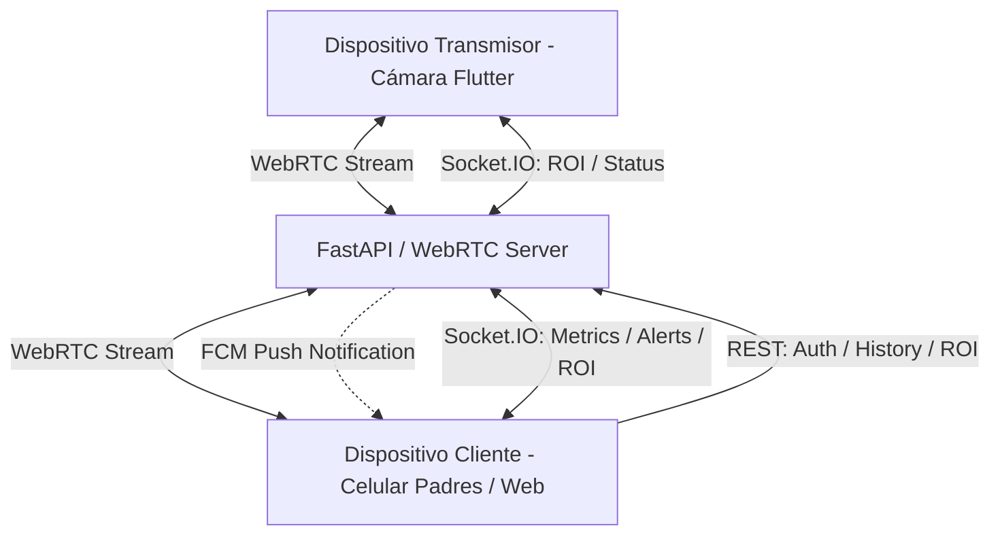

# Desarrollo del Ecosistema Nidus Baby Monitor

Este Skill proporciona las directrices y estándares de desarrollo para implementar y expandir las aplicaciones móvil (Flutter), web (React/Next.js) y el backend (FastAPI) de Nidus Monitor, basándose en la configuración del servidor y sus algoritmos.

---

## 1. Arquitectura de Comunicación y Red

El sistema utiliza un modelo híbrido para lograr transmisión de video en tiempo real de baja latencia con análisis de inteligencia artificial y control bidireccional.



### 1.1. Señalización WebRTC
El servidor actúa como un SFU (Selective Forwarding Unit) ligero y procesador de video. La comunicación WebRTC consta de dos fases:

1. **Cámara Transmisora (Transmitter)**:
   - Envía su oferta SDP en formato JSON a: `POST /webrtc/transmitter/offer`
   - El payload debe ser: `{"sdp": "OFFER_SDP_STRING"}`
   - El servidor responde con la respuesta SDP: `{"sdp": "ANSWER_SDP_STRING", "type": "answer"}`

2. **Celular de Padres / Cliente Web (Client)**:
   - Envía su oferta SDP en formato JSON a: `POST /webrtc/client/offer`
   - El payload debe ser: `{"sdp": "OFFER_SDP_STRING"}`
   - El servidor responde con la respuesta SDP clonada de la cámara activa.

### 1.2. Protocolo Socket.IO
El Socket.IO corre unificado en el puerto `8000` junto con FastAPI.
- **Servicio Socket**: `socketio.AsyncServer(async_mode='asgi', cors_allowed_origins='*')`
- **Eventos del Cliente al Servidor**:
  - `update_roi`: Actualiza la zona segura enviando: `{"x_min": float, "y_min": float, "x_max": float, "y_max": float}` (valores relativos de `0.0` a `1.0`).
- **Eventos del Servidor al Cliente**:
  - `message`: Mensaje de bienvenida inicial: `{"text": "Conexión establecida con NidusMonitor"}`.
  - `metrics`: Métricas en tiempo real transmitidas a `5` FPS:
    ```json
    {
      "state": "deep_sleep" | "moving" | "awake" | "position_change" | "strong_motion" | "out_of_area",
      "ear": float | null,
      "motion": float,
      "in_safe_zone": boolean,
      "baby_detected": boolean,
      "centroid": [float, float] | null,
      "timestamp": float
    }
    ```
  - `alert`: Alerta inmediata por cambio de estado crítico:
    ```json
    {
      "event_type": "strong_motion" | "position_change" | "out_of_area" | "awake",
      "description": "Detalle descriptivo de la alerta...",
      "timestamp": float
    }
    ```

### 1.3. API REST (FastAPI)
- **Autenticación**:
  - `POST /auth/login`: Credenciales `UserLogin` (`username`, `password`). Retorna `Token` (`access_token`, `token_type`).
  - `POST /auth/register`: Registro `UserCreate` (`username`, `password`). Retorna `UserOut`.
- **Configuración de ROI**:
  - `POST /config/roi`: Actualización de la zona segura vía REST (requiere portar token JWT).
- **Historial**:
  - `GET /events/history`: Consulta eventos persistidos (requiere token JWT).

---

## 2. Restricciones del Procesador de Visión (MediaPipe)

Cualquier cambio o desarrollo en la transmisión debe cumplir con los siguientes límites optimizados para hardware con recursos limitados (como una CPU Intel i5 de 5ta Generación):

1. **FPS de Procesamiento**: La tasa de fotogramas del pipeline de IA está restringida a `5 FPS` (`PROCESS_FPS = 5`).
2. **Dimensiones de Procesamiento**: Los frames son redimensionados a `320x240` píxeles (`PROCESS_WIDTH`, `PROCESS_HEIGHT`) antes de enviarse al pipeline de MediaPipe.
3. **Modelos Utilizados**:
   - **MediaPipe Face Mesh**: `max_num_faces=1`, `refine_landmarks=True`.
   - **MediaPipe Pose**: `model_complexity=0` (máxima velocidad y eficiencia).

### Máquina de Estados del Bebé
Los estados son calculados a partir de dos métricas principales:
- **EAR (Eye Aspect Ratio)**: Umbral de ojos abiertos/cerrados = `0.2` (`EAR_THRESHOLD`). Requiere `15` frames consecutivos (~3 segundos a 5 FPS) para consolidar un estado (`EAR_CONSECUTIVE_FRAMES = 15`).
- **Motion Score**: Desplazamiento del centroide del tren superior (nariz, orejas, hombros).

| Estado | EAR | Movimiento | Condición / Delay |
| :--- | :--- | :--- | :--- |
| `deep_sleep` | `< 0.2` (Cerrados) | `< 0.015` (Bajo) | Ojos cerrados por >= 15 frames |
| `moving` | `< 0.2` (Cerrados) | `>= 0.015` | Ojos cerrados por >= 15 frames con movimiento leve |
| `awake` | `>= 0.2` (Abiertos) | Cualquiera | Ojos abiertos por >= 15 frames |
| `position_change` | Cualquiera | `> 0.08` | Desplazamiento repentino (cooldown 8 seg) |
| `strong_motion` | Cualquiera | promedio `> 0.05` | Promedio en últimos 15 frames > 0.05 (ej. llanto) |
| `out_of_area` | N/A | N/A | Bebé no detectado por >= 25 frames (5s) O fuera de ROI |

---

## 3. Guía de Desarrollo en Flutter

### 3.1. Rol Transmisor (`TransmitterScreen`)
La cámara del celular transmite el feed.
- Debe inicializar la cámara local y configurar WebRTC (usando `flutter_webrtc`).
- Debe capturar los frames, enviarlos al servidor mediante el endpoint de WebRTC.
- Para conservar batería y procesador en el móvil, el stream debe limitarse a la resolución objetivo del servidor o escalarse en el backend.

### 3.2. Rol Receptor (`ReceiverScreen`)
El visor de los padres.
- Debe conectarse por Socket.IO al backend para escuchar eventos en tiempo real.
- Debe renderizar el video WebRTC proveniente de `/webrtc/client/offer`.
- Debe escuchar el canal de Socket.IO `metrics` y actualizar la UI con el estado del bebé, su nivel de parpadeo (EAR) y el índice de movimiento.
- Debe responder a eventos de `alert` desplegando alertas sonoras/vibración.

### 3.3. Configuración de Notificaciones FCM
El servidor envía alertas push a través del canal `baby_alerts`.
- Integrar `firebase_messaging` en Flutter.
- Suscribir al usuario al topic `baby_alerts` una vez logueado.
- Manejar `click_action` con valor `FLUTTER_NOTIFICATION_CLICK` para abrir la aplicación directamente en la pantalla de monitoreo (`ReceiverScreen`).

---

## 4. Guía de Desarrollo de Dashboard (Web)

El dashboard web (`apps/dashboard`) debe estructurarse con:
1. **Next.js / React** con TypeScript.
2. **Estilizado Premium**: CSS Limpio y fluido, diseño oscuro (dark mode) relajante.
3. **Conexiones**:
   - Cliente de Socket.IO (`socket.io-client`) apuntando a `settings.HOST:settings.PORT` (ej. `http://localhost:8000`).
   - Lógica de WebRTC para desplegar el stream remoto de forma nativa en la etiqueta `<video>` usando la API del navegador.
